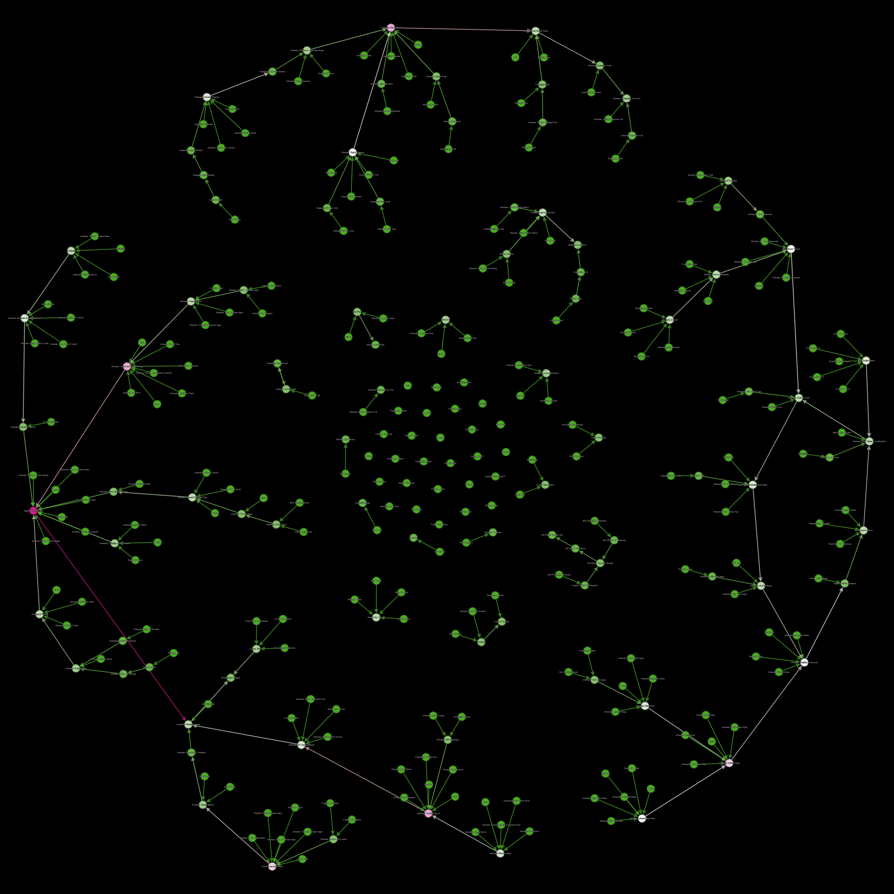

# Satisfactory flowchart

Simple flowchart for [Satisfactory](https://www.satisfactorygame.com/ "Open official Satisfactory website"), a game developed & published by _Coffe Stain Studios_ ([game Steam page](https://store.steampowered.com/app/526870/Satisfactory/ "Open Satisfactory Steam page")).

> [!NOTE]
> TODO
>
> - build interactive graph/flowchart
>

- [`data.json`](#datajson)
- [`data.txt`](#datatxt)
- [`data.dot`](#datadot)
- [`gephi.svg`](#gephisvg)
- [`convert_json.js`](#convert_jsonjs)
- [Extract images](#extract-images)
- [Parsing JSON data (notes)](#parsing-json-data-notes)
- [Legacy U3 flowchart](#legacy-u3-flowchart)

---

## [`data.json`](https://github.com/MAZ01001/SatisfactoryFlowchart/blob/main/data.json "Click to view file in GitHub")

`UTF-8` JSON file with the following structure/formatting

```typescript
declare type DATA_JSON = {
    descriptions: {
        products: [string, number, string, string, string][]; // [ display name, sink value, element type (Solid|Liquid|Gas), IMG path, description ]
        manufacturers: [string, string, string][];            // [ display name, IMG path, description ]
    };
    recipes: {
        name: string;                   // recipe display name
        input: [string, number][];      // [ product display name, amount per cycle (items or m³) ]
        output: [string, number][];     // [ product display name, amount per cycle (items or m³) ]
        machine: [string, ...string[]]; // manufacturer display names
        duration: number;               // time in seconds for one production cycle (items/min = amount * 60 / duration)
    }[];
};
```

<details><summary>click to show/hide example JSON data in <code>en-US</code> language</summary>

```JSON
{
	"descriptions": {
		"products": [
			["Heavy Modular Frame",          10800,"S","./FactoryGame/Content/FactoryGame/Resource/Parts/ModularFrameHeavy/UI/IconDesc_ModularFrameHeavy_256.png",                      "A more robust multipurpose frame."],
			["Nitrogen Gas",                    10,"G","./FactoryGame/Content/FactoryGame/Resource/Parts/PackagedNitrogen/UI/IconDesc_NitrogenGas_256.png",                             "Has a variety of uses, including metallurgy, cooling, and Nitric Acid production. On MASSAGE-2 (AB)b, it can be extracted from underground gas wells."],
			["Water",                            5,"L","./FactoryGame/Content/FactoryGame/Resource/RawResources/Water/UI/LiquidWater_Pipe_256.png",                                     "It's water."],
			// ...
		],
		"manufacturers": [
			["Constructor",         "./FactoryGame/Content/FactoryGame/Buildable/Factory/ConstructorMk1/UI/IconDesc_ConstructorMk1_256.png","Crafts 1 part into another part.\n\nCan be automated by feeding component parts in via a Conveyor Belt connected to the input port. The resulting parts can be automatically extracted by connecting a Conveyor Belt to the output port."],
			["Crafting Bench",      "./FactoryGame/Content/FactoryGame/Buildable/Factory/WorkBench/UI/Workbench_256.png",                   "Allows you to manually craft a wide range of different parts. \nThese parts can then be used to construct various factory buildings, vehicles, and equipment."],
			["Smelter",             "./FactoryGame/Content/FactoryGame/Buildable/Factory/SmelterMk1/UI/IconDesc_SmelterMk1_256.png",        "Smelts ore into ingots.\n\nCan be automated by feeding ore in via a Conveyor Belt connected to the input port. The resulting ingots can be automatically extracted by connecting a Conveyor Belt to the output port."]
			// ...
		]
	},
	"recipes": [
		{
			"name": "Excited Photonic Matter",
			"input": [],
			"output": [["Excited Photonic Matter",10]],
			"machine": ["Converter"],
			"duration": 3
		},
		{
			"name": "Heavy Modular Frame",
			"input": [["Screw",120],["Modular Frame",5],["Steel Pipe",20],["Encased Industrial Beam",5]],
			"output": [["Heavy Modular Frame",1]],
			"machine": ["Manufacturer","Crafting Bench"],
			"duration": 30
		},
		{
			"name": "Ionized Fuel",
			"input": [["Power Shard",1],["Rocket Fuel",16]],
			"output": [["Compacted Coal",2],["Ionized Fuel",16]],
			"machine": ["Refinery"],
			"duration": 24
		},
		// ...
	]
}
```

</details><br>

it uses one tab indentation and except top-levels everything is sorted alphabetically by _name_ with respect to language of _DOCS.json_ file, so binary search is possible (for names)

some additional spaces have been added to make it more human readable

_there are narrow-non-break-spaces (U+202F) in descriptions between value and unit pairs ie `1000-2000\u202FMW`_

_liquid/gas volume is already converted to m³ (from dm³)_

Scroll [UP](#datajson "Scroll to start of section: data.json")
    | [TOP](#satisfactory-flowchart "Scroll to top of document: Satisfactory flowchart")

## [`data.txt`](https://github.com/MAZ01001/SatisfactoryFlowchart/blob/main/data.txt "Click to view file in GitHub")

list of all AWESOME Sink values (coupon cost) in ascending order

Does not include `FICSIT Coupon` (gives `1` each) and lists non-sinkable items like artifacts or waste, with ones that yield DNA points under `0`

Scroll [UP](#datatxt "Scroll to start of section: data.txt")
    | [TOP](#satisfactory-flowchart "Scroll to top of document: Satisfactory flowchart")

## [`data.dot`](https://github.com/MAZ01001/SatisfactoryFlowchart/blob/main/data.dot "Click to view file in GitHub")

directed graph of recipe order

> for all recipes `A` and `B`: when `A.outputs` matches at least one product in `B.inputs`: connect `A -> B`

all recipes are connected via index (same index as `data.json`) and labeled with their name (same language as `data.json`)

first all recipes (with label) then all connections for each recipe (all outgoing connections inline)

Scroll [UP](#datadot "Scroll to start of section: data.dot")
    | [TOP](#satisfactory-flowchart "Scroll to top of document: Satisfactory flowchart")

## [`gephi.svg`](https://github.com/MAZ01001/SatisfactoryFlowchart/blob/main/gephi.svg "Click to view file in GitHub")

a (static) graph view of `data.dot` via <https://github.com/gephi/gephi/> (outdated)

<a href="https://maz01001.github.io/SatisfactoryFlowchart/gephi.png" title="Click to view 4K image full sized"></a>

> SVG with selectable text here: <https://maz01001.github.io/SatisfactoryFlowchart/gephi.svg>

Scroll [UP](#datadot "Scroll to start of section: data.dot")
    | [TOP](#satisfactory-flowchart "Scroll to top of document: Satisfactory flowchart")

## [`convert_json.js`](https://github.com/MAZ01001/SatisfactoryFlowchart/blob/main/convert_json.js "Click to view file in GitHub")

- get `node.js`: <https://github.com/nodejs/node> (easier to install `Visual Studio (Community)` and add `node.js` as dev-environment)

```shell
# generate data.json with en-US language in current directory (overrides data.json)
node convert_json.js /Satisfactory/CommunityResources/Docs/en-US.json data.json

# optionally also generate data.txt to see sink values (overrides data.json and data.txt)
node convert_json.js /Satisfactory/CommunityResources/Docs/en-US.json data.json data.txt

# optionally also generate data.dot for graphing (overrides data.json and data.txt and data.dot)
node convert_json.js /Satisfactory/CommunityResources/Docs/en-US.json data.json data.txt data.dot
```

the script works with any of the languages in the `/Satisfactory/CommunityResources/Docs/` folder; string-sorting is also language dependent

_does not calculate graph connections when `data.dot` CLI-parameter is not supplied_

Scroll [UP](#convert_jsonjs "Scroll to start of section: convert_json.js")
    | [TOP](#satisfactory-flowchart "Scroll to top of document: Satisfactory flowchart")

## Extract images

run script ([`convert_json.js`](#convert_jsonjs)) and copy regexp "FModel IMG path regexp" logged to console (yellow on black, near the end)

- get `7Zip`: <https://7-zip.org/>
- get `FModel`: <https://github.com/4sval/FModel>

1. open `/Satisfactory/FactoryGameSteam.exe` via 7zip, go to folder `.rsrc` and open `version.txt` and see `PRODUCTVERSION` for Unreal-Engine version ~ `5,3,2,0` = `5.3`
2. open FModel and follow the steps at <https://docs.ficsit.app/satisfactory-modding/latest/Development/ExtractGameFiles.html#FModel> \[[archive](https://github.com/satisfactorymodding/Documentation/blob/13a335186fb21965055007ecc9738ee8fa392708/modules/ROOT/pages/Development/ExtractGameFiles.adoc#fmodel "(GitHub) plain text permalink of website")\] (only `FModel` section) but with the Unreal-Engine version from previous step instead
3. then in `Archives` tab (Loading Mode: Multiple) select `FactoryGame-Windows.pak` and `FactoryGame-Windows.utoc` and click on Load, it should switch to the `Folders` tab
4. then click in the folder view and hit <kbd><kbd>Ctrl</kbd>+<kbd>Shift</kbd>+<kbd>F</kbd></kbd> and paste in the "FModel IMG path regexp" from before (make sure to check the `.*` to the right of the search bar) and press <kbd>Enter</kbd>
   - current FModel IMG path regexp (might be outdated): `FactoryGame/Content/FactoryGame/(Resource/|Buildable/Factory/(WorkBench|Workshop|QuantumEncoder|Converter|HadronCollider|OilRefinery|FoundryMk1|Packager|ManufacturerMk1|AssemblerMk1|Blender|SmelterMk1|ConstructorMk1)/).*_256`
5. select all listed files (<kbd><kbd>Ctrl</kbd>+<kbd>A</kbd></kbd>) and right-click and `safe texture (.png)`

after all have finished extracting there should be a folder `FactoryGame` inside `/FModel/Output/Exports` with all the icons;
this is the root folder with the folder structure that the `data.json` expects,
so you can copy paste that to the same directory where you have the `data.json` stored (so the relative-paths in `data.json` work)

Scroll [UP](#extract-images "Scroll to start of section: Extract images")
    | [TOP](#satisfactory-flowchart "Scroll to top of document: Satisfactory flowchart")

## Parsing JSON data (notes)

the JSON file _Coffe Stain Studios_ provides is in `UTF-16 LE + BOM`

JavaScript (node.js) as most languages use UTF-16 natively so that is not a problem but the BOM (0xFEFF) at start of file needs to be ignored so JSON can be parsed → skip first (utf-16) character (2 bytes) when loading file

(relevant) `NativeClass` names (via regexp `\.(\w+)'$`) ! not ordered in JSON file

- product-recipes:
  - `FGRecipe`
  - _under `Classes` each as `{mDisplayName, mIngredients, mProduct, mProducedIn}`_
    - __ignore all that have empty `mProducedIn`__
    - __ignore all that have `BP_BuildGun_C` or `FGBuildGun` in `mProducedIn`__
    - `mProducedIn` ~> regexp match all `"[^".]*\.(\w+)"` for manufacturer-class-name
      - __replace `BP_WorkBenchComponent_C`, `FGBuildableAutomatedWorkBench`, and `Build_AutomatedWorkBench_C` with (just one) `Build_WorkBench_C`__
      - __replace `BP_WorkshopComponent_C` with `Build_Workshop_C`__
    - `mIngredients` and `mProduct` ~> skip first and last 2 chars; split at each `),(` then regexp match `ItemClass="[^']+'[^.]+\.(\w+)'"` (product-class-name) and `Amount=([0-9]+)` (convert to number) on each entry
    - `mManufactoringDuration` is stored as string so parse to float
- product descriptions & img path:
  - `FGAmmoTypeInstantHit`
  - `FGAmmoTypeProjectile`
  - `FGAmmoTypeSpreadshot`
  - `FGConsumableDescriptor`
  - `FGEquipmentDescriptor`
  - `FGResourceDescriptor`
  - `FGPowerShardDescriptor`
  - `FGItemDescriptor`
  - `FGItemDescriptorBiomass`
  - `FGItemDescriptorNuclearFuel`
  - `FGItemDescriptorPowerBoosterFuel`
  - _under `Classes` each as `{ClassName, mDisplayName, mDescription, mForm, mSmallIcon, mResourceSinkPoints}`_
    - use `ClassName` for resolving class names in recipes later
    - replace all `\r\n` in `mDescription` with `\n`
    - `mForm` can be `RF_SOLID`, `RF_LIQUID`, `RF_GAS`, or `RF_INVALID` (string) use first letter and note what is liquid/gas for unit conversion in recipes later
    - `mSmallIcon` for img paths later during resolving class names in recipes
    - `mResourceSinkPoints` for AWESOME Sink points (DNA points are not given and others at 0 will clog the sink)
- manufacturer descriptions:
  - `FGBuildableManufacturer`
  - `FGBuildableManufacturerVariablePower`
  - __and from `FGBuildable` only `Build_WorkBench_C` and `Build_Workshop_C`__
  - _under `Classes` each as `{ClassName, mDisplayName, mDescription}`_
- manufacturer img path:
  - `FGBuildingDescriptor`
    - __includes more than those found under "manufacturer descriptions"__
  - _under `Classes` each as `{ClassName, mDisplayName, mSmallIcon}`_
    - ignore all where `ClassName` matches regexp `Beam|Blue|[Ww]alk|Conveyor|Foundation|Generator|Jump|Miner|Pi(?:llar|pe)|Power|Roof|Sign|Storage|Train|Wall|Set_|_8x` (for most but not all redundant images)

after parsing, when resolving class names in recipes, for every `mSmallIcon` replace `_512` with `_256` then match with regexp `Texture2D /Game/([^.]*)\.` and replace entire string with `"/FactoryGame/Content/$1.png"` (where `$1` is from the regexp match) to match [extracted images](#extract-images) paths/folder structure

also check if any name in recipes in-/output is a liquid/gas and convert amount accordingly (divide by 1000 when liquid/gas otherwise do nothing)

Scroll [UP](#parsing-json-data-notes "Scroll to start of section: Parsing JSON data (notes)")
    | [TOP](#satisfactory-flowchart "Scroll to top of document: Satisfactory flowchart")

## Legacy U3 flowchart

if you want to see the old flowchart I made for the U3 (0.3) version of Satisfactory, you can find the code in the legacy branch in this repo
and a wayback-machine snapshot of the website here: <https://web.archive.org/web/20240919112412/https://maz01001.github.io/site/satisfactory_u3_flowchart>

it might still be available at its original location <https://maz01001.github.io/site/satisfactory_u3_flowchart>
and the source code at [MAZ01001/MAZ01001.github.io/site/satisfactory_u3_flowchart.html](https://github.com/MAZ01001/MAZ01001.github.io/blob/master/site/satisfactory_u3_flowchart.html "open file in GitHub repository")

Scroll [UP](#legacy-u3-flowchart "Scroll to start of section: Legacy U3 flowchart")
    | [TOP](#satisfactory-flowchart "Scroll to top of document: Satisfactory flowchart")
